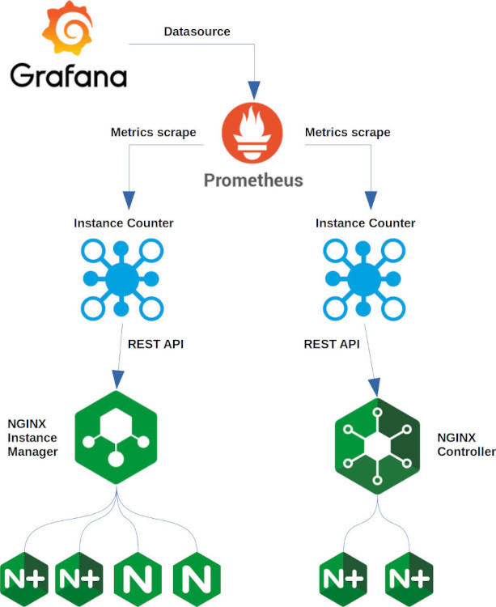
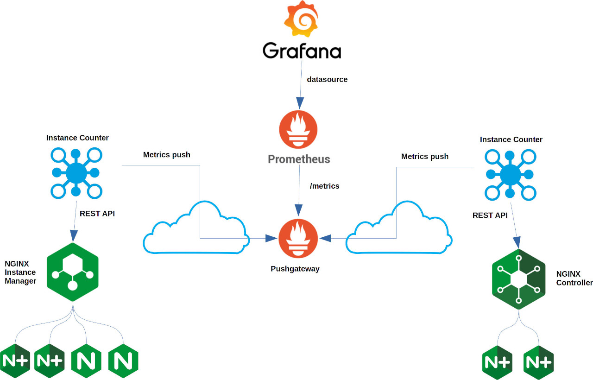

# NGINX Instance Counter

## Description

This tool helps tracking NGINX Plus instances managed by NGINX Controller and NGINX Instance Manager, and BIG-IP instances managed by BIG-IQ

It has been tested against:

- NGINX Controller 3.18, 3.18.2, apim-3.19.2
- NGINX Instance Manager 1.0.1, 1.0.2, 1.0.3, 1.0.4
- BIG-IQ 8.1.0, 8.1.0.2

Communication to NGINX Controller / NGINX Instance Manager / BIG-IQ is based on REST API, current features are:

- REST API mode
  - `/instances` and `/counter/instances` - return JSON output
  - `/metrics` and `/counter/metrics` - return Prometheus compliant output
- High level reporting
  - `/reporting/xls` and `/counter/reporting/xls` - return a reporting spreadsheet in xls format (currently supported for BIG-IQ, when running as native python code and docker image only)
- Push mode
  - POSTs instance statistics to a user-defined HTTP(S) URL (STATS_PUSH_MODE: CUSTOM)
  - Pushes instance statistics to pushgateway (STATS_PUSH_MODE: NGINX_PUSH)
  - Basic authentication support
  - Configurable push interval (in seconds)
- Automated e-mail reporting
  - Sends an email containing the report JSON file as an attachment named nginx_report.json for NGINX Instance Manager and NGINX Controller, and bigip_report.json for BIG-IQ
  - Support for plaintext SMTP, STARTTLS, SMTP over TLS, SMTP authentication, custom SMTP port
  - Configurable push interval (in days)
- HTTP(S) proxy support
- CVE tracking
- Resource and applications telemetry (currently supported for BIG-IQ, when running as native python code and docker image only)

## Additional tools

Additional tools can be found [here](/contrib)

## Deployment modes

Pull mode: Instance Counter fetches stats



Push mode: Instance Counter pushes stats to a remote data collection and visualization environment (suitable for distributed setups)



## Prerequisites

- Kubernetes or Openshift cluster
- Private registry to push the NGINX Instance Counter image
- One of:
  - NGINX Controller 3.18, 3.18.2, apim-3.19.2
  - NGINX Instance Manager 1.0.1, 1.0.2, 1.0.3, 1.0.4
  - BIG-IQ 8.1.0, 8.1.0.2
- SMTP server if automated email reporting is used
- NIST NVD REST API Key for full CVE tracking (https://nvd.nist.gov/developers/request-an-api-key)

# How to build and run

## For Kubernetes/Openshift

The NGINX Instance Counter image is available on Docker Hub as:

```
fiorucci/nginx-instance-counter:5.0
```

The 1.instancecounter.yaml file references that by default.

If you need to build and push NGINX your own image to a private registry:

```
git clone fabriziofiorucci/NGINX-InstanceCounter
cd NGINX-InstanceCounter/nginx-instance-counter

docker build --no-cache -t PRIVATE_REGISTRY:PORT/nginx-instance-counter:5.0 .
docker push PRIVATE_REGISTRY:PORT/nginx-instance-counter:5.0
```

## As a native python application

NGINX Instance Counter requires:

- Any Linux distribution
- Python 3 (tested on 3.9+)
- [FastAPI](https://fastapi.tiangolo.com/)
- [Uvicorn](https://www.uvicorn.org/)
- [Requests](https://docs.python-requests.org/en/master/)
- [XLSX Writer](https://pypi.org/project/XlsxWriter/)
- [Pandas](https://pandas.pydata.org/)

nginx-instance-counter/nicstart.sh is a sample script to run NGINX Instance Counter from bash

## As a portable application

- [All portable images](/portable)
- [AppImage for Linux](/portable/Linux)
- [AppImage for Windows 10](/portable/Windows)

## Offline BIG-IQ mode

See the [BIG-IQ Collection script](/contrib/bigiq-collect)

# How to deploy

## For Kubernetes/Openshift

```
cd NGINX-InstanceCounter/manifests
```

Edit `1.instancecounter.yaml` to customize:

- image name:
  - To be set to your private registry image (only if not using the image available on Docker Hub)
- environment variables:

| Variable  | Description |
| ------------- |-------------|
| NIC_ADDRESS | optional IP address NGINX Instance Counter should listen on. Default is 0.0.0.0 |
| NIC_PORT| optional TCP port NGINX Instance Counter should listen on. Default is 5000
| HTTP_PROXY| to be set if HTTP proxy must be used to connect to NGINX Controller, NGINX Instance Manager or BIG-IQ
| HTTPS_PROXY| to be set if HTTPS proxy must be used to connect to NGINX Controller, NGINX Instance Manager or BIG-IQ
| NIST_API_KEY| API Key for full NIST NVD CVE tracking (get your key at https://nvd.nist.gov/developers/request-an-api-key)
| NGINX_CONTROLLER_TYPE| can be NGINX_CONTROLLER, NGINX_INSTANCE_MANAGER or BIG_IQ
| NGINX_CONTROLLER_FQDN| the FQDN of your NGINX Controller / NGINX Instance Manager / BIG-IQ instance| format must be http[s]://FQDN:port
| NGINX_CONTROLLER_USERNAME| the username for authentication
| NGINX_CONTROLLER_PASSWORD| the password for authentication
| STATS_PUSH_ENABLE | if set to "true" push mode is enabled, disabled if set to "false" |
| STATS_PUSH_MODE | either CUSTOM or NGINX_PUSH, to push (HTTP POST) JSON to custom URL and to push metrics to pushgateway, respectively |
| STATS_PUSH_URL | the URL where to push statistics |
| STATS_PUSH_INTERVAL | the interval in seconds between two consecutive push |
| STATS_PUSH_USERNAME | (optional) the username for POST Basic Authentication |
| STATS_PUSH_PASSWORD | (optional) the password for POST Basic Authentication |
| EMAIL_ENABLED | if set to "true" automated email reporting is enabled, disabled if set to "false" |
| EMAIL_INTERVAL| the interval in days between two consecutive email reports |
| EMAIL_SERVER | the FQDN of the SMTP server to use |
| EMAIL_SERVER_PORT| the SMTP server port |
| EMAIL_SERVER_TYPE| either "plaintext", "starttls" or "ssl" |
| EMAIL_AUTH_USER| optional, the username for SMTP authentication |
| EMAIL_AUTH_PASS| optional, the password for SMTP authentication |
| EMAIL_SENDER| the sender email address |
| EMAIL_RECIPIENT| the recipient email address |

- Ingress host:
  - By default it is set to counter.nginx.ff.lan

For standalone operations (ie. REST API + optional push to custom URL):

```
kubectl apply -f 0.ns.yaml
kubectl apply -f 1.instancecounter.yaml
```

To push statistics to pushgateway also apply:

```
kubectl apply -f 2.prometheus.yaml
kubectl apply -f 3.grafana.yaml
kubectl apply -f 4.pushgateway.yaml
```

By default `2.prometheus.yaml` is configured for push mode, it must be edited decommenting the relevant section for pull mode

To setup visualization:

- Grafana shall be configured with a Prometheus datasource using by default http://prometheus.nginx.ff.lan
- Import the `contrib/grafana/NGINX-InstanceCounter-dashboard.json` sample dashboard in Grafana

Service names created by default as Ingress resources are:

- counter.nginx.ff.lan - REST API and Prometheus scraping endpoint
- pushgateway.nginx.ff.lan - Pushgateway web GUI
- prometheus.nginx.ff.lan - Prometheus web GUI
- grafana.nginx.ff.lan - Grafana visualization web GUI

## As a native python application

Edit nginx-instance-counter/nicstart.sh and run it

## Using F5 Support solutions

See F5 Support solutions:

- K83394355: How to count the number of NGINX instances with NGINX Instance Manager - https://support.f5.com/csp/article/K83394355
- K45028541: How to count the number of NGINX instances with NGINX Controller - https://support.f5.com/csp/article/K45028541

# Usage

See the [usage page](/USAGE.md)
