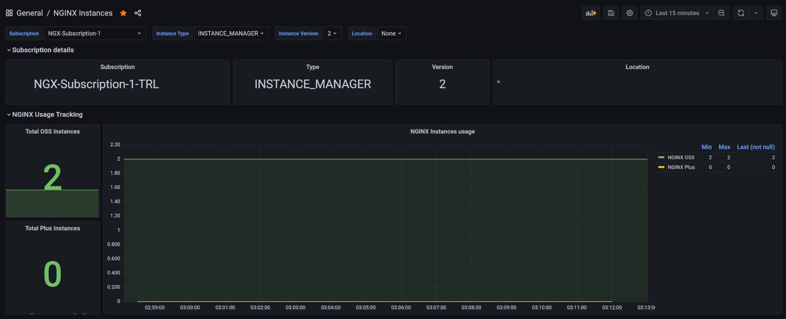
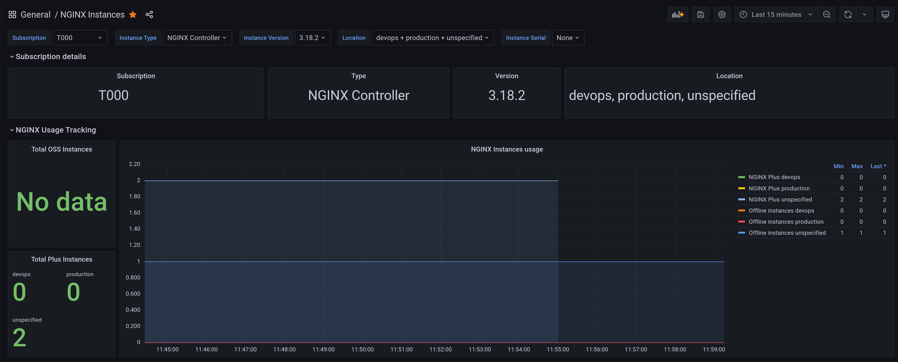
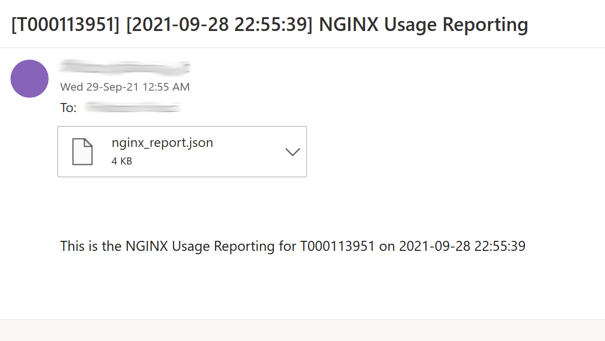

# NGINX Instance Counter

## Description

This tool helps tracking NGINX Plus instances managed by NGINX Controller and NGINX Instance Manager, and BIG-IP instances managed by BIG-IQ

It has been tested against:

- NGINX Controller 3.18, 3.18.2, apim-3.19.2
- NGINX Instance Manager 1.0.1, 1.0.2, 1.0.3
- BIG-IQ 8.1.0, 8.1.0.2

Communication to NGINX Controller / NGINX Instance Manager / BIG-IQ is based on REST API, current features are:

- REST API mode
  - /instances and /counter/instances - return JSON output
  - /metrics and /counter/metrics - return Prometheus compliant output
- Push mode
  - POSTs instance statistics to a user-defined HTTP(S) URL (STATS_PUSH_MODE: CUSTOM)
  - Pushes instance statistics to pushgateway (STATS_PUSH_MODE: NGINX_PUSH)
  - Basic authentication support
  - Configurable push interval (in seconds)
- Automated e-mail reporting
  - Sends an email containing the report JSON file as an attachment named nginx_report.json for NGINX Instance Manager and NGINX Controller, and bigip_report.json for BIG-IQ
  - Support for plaintext SMTP, STARTTLS, SMTP over TLS, SMTP authentication, custom SMTP port
  - Configurable push interval (in days)
- HTTP(S) proxy support
- CVE tracking (beta - currently available for BIG-IQ mode)

## Deployment modes

Pull mode: Instance Counter fetches stats


Push mode: Instance Counter pushes stats to a remote data collection and visualization environment (suitable for distributed setups)


## Prerequisites

- Kubernetes or Openshift cluster
- Private registry to push the NGINX Instance Counter image
- One of:
  - NGINX Controller 3.18, 3.18.2, apim-3.19.2
  - NGINX Instance Manager 1.0.1, 1.0.2, 1.0.3
  - BIG-IQ 8.1.0, 8.1.0.2
- SMTP server if automated email reporting is used
- NIST NVD REST API Key for full CVE tracking (https://nvd.nist.gov/developers/request-an-api-key)

# How to build and run

## For Kubernetes/Openshift

The NGINX Instance Counter image is available on Docker Hub as:

```
fiorucci/nginx-instance-counter:4.3
```

The 1.instancecounter.yaml file references that by default.

If you need to build and push NGINX your own image to a private registry:

```
git clone fabriziofiorucci/NGINX-InstanceCounter
cd NGINX-InstanceCounter/nginx-instance-counter

docker build --no-cache -t PRIVATE_REGISTRY:PORT/nginx-instance-counter:4.3 .
docker push PRIVATE_REGISTRY:PORT/nginx-instance-counter:4.3
```

## As a native python application

NGINX Instance Counter requires:

- Any Linux distribution
- Python 3 (tested on 3.9+)
- [Flask framework](https://flask.palletsprojects.com/en/2.0.x/)
- [Requests](https://docs.python-requests.org/en/master/)

nginx-instance-counter/nicstart.sh is a sample script to run NGINX Instance Counter from bash

## As a portable application

- [All portable images](/portable)
- [AppImage for Linux](/portable/Linux)
- [AppImage for Windows 10](/portable/Windows)

## Offline BIG-IQ mode

See the [BIG-IQ Collection script](/contrib/bigiq-collect)

# How to deploy

## For Kubernetes/Openshift

```
cd NGINX-InstanceCounter/manifests
```

Edit 1.instancecounter.yaml to customize:

- image name:
  - To be set to your private registry image (only if not using the image available on Docker Hub)
- environment variables:
  - NIC_ADDRESS - optional IP address NGINX Instance Counter should listen on. Default is 0.0.0.0
  - NIC_PORT - optional TCP port NGINX Instance Counter should listen on. Default is 5000

  - HTTP_PROXY - to be set if HTTP proxy must be used to connect to NGINX Controller, NGINX Instance Manager or BIG-IQ
  - HTTPS_PROXY - to be set if HTTPS proxy must be used to connect to NGINX Controller, NGINX Instance Manager or BIG-IQ

  - NIST_API_KEY - API Key for full NIST NVD CVE tracking (get your key at https://nvd.nist.gov/developers/request-an-api-key)

  - NGINX_CONTROLLER_TYPE - can be NGINX_CONTROLLER, NGINX_INSTANCE_MANAGER or BIG_IQ
  - NGINX_CONTROLLER_FQDN - the FQDN of your NGINX Controller / NGINX Instance Manager / BIG-IQ instance - format must be http[s]://FQDN:port
  - NGINX_CONTROLLER_USERNAME - the username for authentication
  - NGINX_CONTROLLER_PASSWORD - the password for authentication

  - STATS_PUSH_ENABLE - if set to "true" push mode is enabled, disabled if set to "false"
  - STATS_PUSH_MODE - either CUSTOM or NGINX_PUSH, to push (HTTP POST) JSON to custom URL and to push metrics to pushgateway, respectively
  - STATS_PUSH_URL - the URL where to push statistics
  - STATS_PUSH_INTERVAL - the interval in seconds between two consecutive push
  - STATS_PUSH_USERNAME - (optional) the username for POST Basic Authentication
  - STATS_PUSH_PASSWORD - (optional) the password for POST Basic Authentication

  - EMAIL_ENABLED - if set to "true" automated email reporting is enabled, disabled if set to "false"
  - EMAIL_INTERVAL - the interval in days between two consecutive email reports
  - EMAIL_SERVER - the FQDN of the SMTP server to use
  - EMAIL_SERVER_PORT - the SMTP server port
  - EMAIL_SERVER_TYPE - either "plaintext", "starttls" or "ssl"
  - EMAIL_AUTH_USER - optional, the username for SMTP authentication
  - EMAIL_AUTH_PASS - optional, the password for SMTP authentication
  - EMAIL_SENDER - the sender email address
  - EMAIL_RECIPIENT - the recipient email address
- Ingress host:
  - By default it is set to counter.nginx.ff.lan

For standalone operations (ie. REST API + optional push to custom URL):

```
kubectl apply -f 0.ns.yaml
kubectl apply -f 1.instancecounter.yaml
```

To push statistics to pushgateway also apply:

```
kubectl apply -f 2.prometheus.yaml
kubectl apply -f 3.grafana.yaml
kubectl apply -f 4.pushgateway.yaml
```

By default 2.prometheus.yaml is configured for push mode, it must be edited decommenting the relevant section for pull mode

To setup visualization:

- Grafana shall be configured with a Prometheus datasource using by default http://prometheus.nginx.ff.lan
- Import the dashboard NGINX-InstanceCounter-dashboard.json in Grafana

Service names created by default as Ingress resources are:

- counter.nginx.ff.lan - REST API and Prometheus scraping endpoint
- pushgateway.nginx.ff.lan - Pushgateway web GUI
- prometheus.nginx.ff.lan - Prometheus web GUI
- grafana.nginx.ff.lan - Grafana visualization web GUI

## As a native python application

Edit nginx-instance-counter/nicstart.sh and run it

## Using F5 Support solutions

See F5 Support solutions:

- K83394355: How to count the number of NGINX instances with NGINX Instance Manager - https://support.f5.com/csp/article/K83394355
- K45028541: How to count the number of NGINX instances with NGINX Controller - https://support.f5.com/csp/article/K45028541

# Usage

## REST API mode

To get instance statistics in JSON format:

NGINX Instance Manager

```
$ curl -s http://counter.nginx.ff.lan/instances | jq
{
  "subscription": {
    "id": "NGX-Subscription-1-TRL-XXXXXX",
    "type": "INSTANCE_MANAGER",
    "version": "1.0.2",
    "serial": "6232847160738694"
  },
  "instances": [
    {
      "nginx_plus_online": 0,
      "nginx_oss_online": 1
    }
  ],
  "details": [
    {
      "instance_id": "c613e90d-3051-4090-b9cd-a32cb725b785",
      "uname": "Linux vm-gw 5.7.6 #1 SMP PREEMPT Fri Jun 26 17:39:22 CEST 2020 x86_64 QEMU Virtual CPU version 2.5+ AuthenticAMD GNU/Linux",
      "containerized": "False",
      "type": "oss",
      "version": "1.20.1",
      "last_seen": "2021-08-31T11:37:04.587986759Z",
      "createtime": "2021-08-18T22:02:49.717530751Z",
      "modules": {},
      "networkconfig": {
        "host_ips": [
          "192.168.1.5",
          "192.168.1.27",
          "192.168.10.5",
          "192.168.11.5",
          "192.168.2.5",
          "10.200.200.10"
        ]
      },
      "hostname": "vm-gw"
    }
  ]
}
```

NGINX Controller

```
$ curl -s http://counter.nginx.ff.lan/instances | jq 
{
  "subscription": {
    "id": "XYZ",
    "type": "NGINX Controller",
    "version": "3.18.2"
  },
  "instances": [
    {
      "location": "devops",
      "nginx_plus_online": 2,
      "nginx_plus_offline": 3
    },
    {
      "location": "production",
      "nginx_plus_online": 0,
      "nginx_plus_offline": 0
    },
    {
      "location": "unspecified",
      "nginx_plus_online": 0,
      "nginx_plus_offline": 2
    }
  ],
  "details": [
    {
      "instance_id": "2933d801-02f6-4a1e-bd76-213e6a723235",
      "uname": "linux Ubuntu 18.04.5 LTS (Bionic Beaver) x86_64 QEMU Virtual CPU version 2.5+",
      "containerized": "True",
      "type": "plus",
      "version": "1.19.10",
      "last_seen": "2021-08-22T08:32:52.058499Z",
      "createtime": "2021-08-20T15:22:52.069915Z",
      "networkConfig": {
        "networkInterfaces": [
          {
            "name": "lo",
            "privateIP": "127.0.0.1"
          },
          {
            "name": "eth0",
            "privateIP": "10.244.2.31"
          }
        ]
      },
      "hostname": "nginx-76cd77586b-76g8k",
      "name": "nginx-devportal"
    },
    {
      "instance_id": "61b945d0-6e4d-4225-a91f-52ae36b290cc",
      "uname": "linux Ubuntu 18.04.5 LTS (Bionic Beaver) x86_64 QEMU Virtual CPU version 2.5+",
      "containerized": "True",
      "type": "plus",
      "version": "1.19.10",
      "last_seen": "2021-09-15T16:37:48.566275Z",
      "createtime": "2021-08-23T10:11:48.527776Z",
      "networkConfig": {
        "networkInterfaces": [
          {
            "name": "lo",
            "privateIP": "127.0.0.1"
          },
          {
            "name": "eth0",
            "privateIP": "10.244.1.41"
          }
        ]
      },
      "hostname": "nginx-76cd77586b-xs5mm",
      "name": "nginx-76cd77586b-xs5mm"
    },
    {
      "instance_id": "e56260de-691f-4585-a4f5-9f6a93095f73",
      "uname": "linux Ubuntu 18.04.5 LTS (Bionic Beaver) x86_64 QEMU Virtual CPU version 2.5+",
      "containerized": "True",
      "type": "plus",
      "version": "1.19.10",
      "last_seen": "2021-08-22T08:33:31.006875Z",
      "createtime": "2021-08-20T15:22:30.439847Z",
      "networkConfig": {
        "networkInterfaces": [
          {
            "name": "lo",
            "privateIP": "127.0.0.1"
          },
          {
            "name": "eth0",
            "privateIP": "10.244.2.30"
          }
        ]
      },
      "hostname": "nginx-76cd77586b-srb4c",
      "name": "nginx-76cd77586b-srb4c"
    },
    {
      "instance_id": "fb67428e-40f6-43a8-bcda-0621ee0d4331",
      "uname": "linux Ubuntu 18.04.5 LTS (Bionic Beaver) x86_64 QEMU Virtual CPU version 2.5+",
      "containerized": "True",
      "type": "plus",
      "version": "1.19.10",
      "last_seen": "2021-09-15T16:37:46.244602Z",
      "createtime": "2021-08-23T10:11:46.561424Z",
      "networkConfig": {
        "networkInterfaces": [
          {
            "name": "lo",
            "privateIP": "127.0.0.1"
          },
          {
            "name": "eth0",
            "privateIP": "10.244.2.41"
          }
        ]
      },
      "hostname": "nginx-76cd77586b-n8f2k",
      "name": "nginx-api"
    },
    {
      "instance_id": "d78c7b6c-bde3-458c-933d-847d023bb2d5",
      "uname": "linux Ubuntu 20.04.3 LTS (Focal Fossa) x86_64 QEMU Virtual CPU version 2.5+",
      "containerized": "False",
      "type": "plus",
      "version": "1.19.10",
      "last_seen": "2021-09-13T22:01:05.598863Z",
      "createtime": "2021-08-23T10:48:05.403247Z",
      "networkConfig": {
        "networkInterfaces": [
          {
            "name": "lo",
            "privateIP": "127.0.0.1",
            "privateIPv6": "::1"
          },
          {
            "name": "ens3",
            "privateIP": "192.168.1.26",
            "privateIPv6": "fe80::dcad:beff:feef:4413"
          },
          {
            "name": "docker0",
            "privateIP": "172.17.0.1",
            "privateIPv6": "fe80::42:1aff:fe50:e757"
          }
        ]
      },
      "hostname": "ubuntu",
      "name": "ubuntu"
    },
    {
      "instance_id": "ada757cf-df90-4125-b966-8db891431835",
      "uname": "linux Ubuntu 18.04.5 LTS (Bionic Beaver) x86_64 QEMU Virtual CPU version 2.5+",
      "containerized": "True",
      "type": "plus",
      "version": "1.19.10",
      "last_seen": "2021-08-19T09:57:52.472761Z",
      "createtime": "2021-08-19T09:57:52.003188Z",
      "networkConfig": {
        "networkInterfaces": [
          {
            "name": "lo",
            "privateIP": "127.0.0.1"
          },
          {
            "name": "eth0",
            "privateIP": "10.244.1.29"
          }
        ]
      },
      "hostname": "nginx-646545df5d-h2p7f",
      "name": "nginx-646545df5d-h2p7f"
    },
    {
      "instance_id": "c9409b38-17d8-4345-9f31-b37f816195a8",
      "uname": "linux Ubuntu 18.04.5 LTS (Bionic Beaver) x86_64 QEMU Virtual CPU version 2.5+",
      "containerized": "True",
      "type": "plus",
      "version": "1.19.10",
      "last_seen": "2021-08-19T09:57:53.956519Z",
      "createtime": "2021-08-19T09:57:53.478961Z",
      "networkConfig": {
        "networkInterfaces": [
          {
            "name": "lo",
            "privateIP": "127.0.0.1"
          },
          {
            "name": "eth0",
            "privateIP": "10.244.1.30"
          }
        ]
      },
      "hostname": "nginx-646545df5d-5wkqv",
      "name": "nginx-646545df5d-5wkqv"
    }
  ]
}
```

BIG-IQ

```
$ curl -s http://counter.nginx.ff.lan/instances | jq
{
  "instances": [
    {
      "bigip": "2",
      "hwTotals": [
        {
          "F5-VE": 2
        }
      ],
      "swTotals": [
        {
          "H-VE-LTM": 2,
          "H-VE-DNS": 1,
          "H-VE-AWF": 1,
          "H-VE-AFM": 1
        }
      ]
    }
  ],
  "details": [
    {
      "hostname": "bigip1.f5.ff.lan",
      "address": "192.168.1.69",
      "product": "BIG-IP",
      "version": "16.1.0",
      "edition": "Final",
      "build": "0.0.19",
      "isVirtual": "True",
      "isClustered": "False",
      "platformMarketingName": "BIG-IP Virtual Edition",
      "restFrameworkVersion": "16.1.0-0.0.19",
      "inventoryTimestamp": "1636713114979",
      "inventoryStatus": "full",
      "platform": {
        "code": "Z100",
        "type": "VE",
        "sku": "F5-VE"
      },
      "registrationKey": "XXXXX-XXXXX-XXXXX-XXXXX-XXXXXXX",
      "chassisSerialNumber": "00000000-0000-0000-000000000000",
      "licenseEndDateTime": "2021-11-27T00:00:00+01:00",
      "licensedModules": [
        "adc",
        "BigIPDevice"
      ],
      "provisionedModules": [
        {
          "module": "afm",
          "level": "none",
          "sku": "H-VE-AFM"
        },
        {
          "module": "dos",
          "level": "",
          "sku": ""
        },
        {
          "module": "ltm",
          "level": "nominal",
          "sku": "H-VE-LTM"
        },
        {
          "module": "asm",
          "level": "none",
          "sku": "H-VE-AWF"
        },
        {
          "module": "avr",
          "level": "",
          "sku": ""
        },
        {
          "module": "sslo",
          "level": "none",
          "sku": "H-VE-SSLO"
        },
        {
          "module": "ilx",
          "level": "",
          "sku": ""
        },
        {
          "module": "cgnat",
          "level": "none",
          "sku": "H-VE-CGNAT"
        },
        {
          "module": "swg",
          "level": "",
          "sku": ""
        },
        {
          "module": "gtm",
          "level": "nominal",
          "sku": "H-VE-DNS"
        },
        {
          "module": "lc",
          "level": "",
          "sku": ""
        },
        {
          "module": "pem",
          "level": "none",
          "sku": "H-VE-PEM"
        },
        {
          "module": "apm",
          "level": "none",
          "sku": "H-VE-APM"
        },
        {
          "module": "urldb",
          "level": "",
          "sku": ""
        },
        {
          "module": "fps",
          "level": "",
          "sku": ""
        }
      ],
      "CVE": [
        {
          "CVE-2021-23037": {
            "id": "CVE-2021-23037",
            "url": "https://support.f5.com/csp/article/K21435974",
            "description": "On all versions of 16.1.x, 16.0.x, 15.1.x, 14.1.x, 13.1.x, 12.1.x, and 11.6.x, a reflected cross-site scripting (XSS) vulnerability exists in an undisclosed page of the BIG-IP Configuration utility that allows an attacker to execute JavaScript in the context of the currently logged-in user. Note: Software versions which have reached End of Technical Support (EoTS) are not evaluated.",
            "tags": [
              "Mitigation",
              "Vendor Advisory"
            ]
          },
          "CVE-2021-23043": {
            "id": "CVE-2021-23043",
            "url": "https://support.f5.com/csp/article/K63163637",
            "description": "On BIG-IP, on all versions of 16.1.x, 16.0.x, 15.1.x, 14.1.x, 13.1.x, 12.1.x, and 11.6.x, a directory traversal vulnerability exists in an undisclosed page of the BIG-IP Configuration utility that allows an attacker to access arbitrary files. Note: Software versions which have reached End of Technical Support (EoTS) are not evaluated.",
            "tags": [
              "Vendor Advisory"
            ]
          }
        }
      ]
    },
    {
      "hostname": "bigip.f5.ff.lan",
      "address": "192.168.1.70",
      "product": "BIG-IP",
      "version": "16.1.0",
      "edition": "Final",
      "build": "0.0.19",
      "isVirtual": "True",
      "isClustered": "False",
      "platformMarketingName": "BIG-IP Virtual Edition",
      "restFrameworkVersion": "16.1.0-0.0.19",
      "inventoryTimestamp": "1636713114979",
      "inventoryStatus": "full",
      "platform": {
        "code": "Z100",
        "type": "VE",
        "sku": "F5-VE"
      },
      "registrationKey": "XXXXX-XXXXX-XXXXX-XXXXX-XXXXXXX",
      "chassisSerialNumber": "00000000-0000-0000-000000000000",
      "licenseEndDateTime": "2021-11-26T00:00:00+01:00",
      "licensedModules": [
        "asmsecurity",
        "adc",
        "Access",
        "dns",
        "BigIPDevice",
        "networksecurity",
        "sharedsecurity"
      ],
      "provisionedModules": [
        {
          "module": "sslo",
          "level": "none",
          "sku": "H-VE-SSLO"
        },
        {
          "module": "gtm",
          "level": "none",
          "sku": "H-VE-DNS"
        },
        {
          "module": "cgnat",
          "level": "none",
          "sku": "H-VE-CGNAT"
        },
        {
          "module": "apm",
          "level": "none",
          "sku": "H-VE-APM"
        },
        {
          "module": "ltm",
          "level": "nominal",
          "sku": "H-VE-LTM"
        },
        {
          "module": "fps",
          "level": "",
          "sku": ""
        },
        {
          "module": "avr",
          "level": "",
          "sku": ""
        },
        {
          "module": "dos",
          "level": "",
          "sku": ""
        },
        {
          "module": "lc",
          "level": "",
          "sku": ""
        },
        {
          "module": "pem",
          "level": "none",
          "sku": "H-VE-PEM"
        },
        {
          "module": "urldb",
          "level": "",
          "sku": ""
        },
        {
          "module": "swg",
          "level": "",
          "sku": ""
        },
        {
          "module": "asm",
          "level": "nominal",
          "sku": "H-VE-AWF"
        },
        {
          "module": "ilx",
          "level": "",
          "sku": ""
        },
        {
          "module": "afm",
          "level": "nominal",
          "sku": "H-VE-AFM"
        }
      ],
      "CVE": [
        {
          "CVE-2021-23037": {
            "id": "CVE-2021-23037",
            "url": "https://support.f5.com/csp/article/K21435974",
            "description": "On all versions of 16.1.x, 16.0.x, 15.1.x, 14.1.x, 13.1.x, 12.1.x, and 11.6.x, a reflected cross-site scripting (XSS) vulnerability exists in an undisclosed page of the BIG-IP Configuration utility that allows an attacker to execute JavaScript in the context of the currently logged-in user. Note: Software versions which have reached End of Technical Support (EoTS) are not evaluated.",
            "tags": [
              "Mitigation",
              "Vendor Advisory"
            ]
          },
          "CVE-2021-23043": {
            "id": "CVE-2021-23043",
            "url": "https://support.f5.com/csp/article/K63163637",
            "description": "On BIG-IP, on all versions of 16.1.x, 16.0.x, 15.1.x, 14.1.x, 13.1.x, 12.1.x, and 11.6.x, a directory traversal vulnerability exists in an undisclosed page of the BIG-IP Configuration utility that allows an attacker to access arbitrary files. Note: Software versions which have reached End of Technical Support (EoTS) are not evaluated.",
            "tags": [
              "Vendor Advisory"
            ]
          }
        }
      ]
    }
  ]
}
```

Prometheus endpoint:

Pulling from NGINX Instance Manager

```
$ curl -s http://counter.nginx.ff.lan/metrics
# HELP nginx_oss_online_instances Online NGINX OSS instances
# TYPE nginx_oss_online_instances gauge
nginx_oss_online_instances{subscription="NGX-Subscription-1-TRL-064788",instanceType="INSTANCE_MANAGER",instanceVersion="1.0.2",instanceSerial="6232847160738694"} 1
# HELP nginx_plus_online_instances Online NGINX Plus instances
# TYPE nginx_plus_online_instances gauge
nginx_plus_online_instances{subscription="NGX-Subscription-1-TRL-064788",instanceType="INSTANCE_MANAGER",instanceVersion="1.0.2",instanceSerial="6232847160738694"} 0
```

Pulling from NGINX Controller

```
$ curl -s http://counter.nginx.ff.lan/metrics
# HELP nginx_plus_online_instances Online NGINX Plus instances
# TYPE nginx_plus_online_instances gauge
nginx_plus_online_instances{subscription="NGX-Subscription-1-TRL-046027",instanceType="NGINX Controller",instanceVersion="3.18.2",location="test"} 0
# HELP nginx_plus_offline_instances Offline NGINX Plus instances
# TYPE nginx_plus_offline_instances gauge
nginx_plus_offline_instances{subscription="NGX-Subscription-1-TRL-046027",instanceType="NGINX Controller",instanceVersion="3.18.2",location="test"} 0
# HELP nginx_plus_online_instances Online NGINX Plus instances
# TYPE nginx_plus_online_instances gauge
nginx_plus_online_instances{subscription="NGX-Subscription-1-TRL-046027",instanceType="NGINX Controller",instanceVersion="3.18.2",location="unspecified"} 2
# HELP nginx_plus_offline_instances Offline NGINX Plus instances
# TYPE nginx_plus_offline_instances gauge
nginx_plus_offline_instances{subscription="NGX-Subscription-1-TRL-046027",instanceType="NGINX Controller",instanceVersion="3.18.2",location="unspecified"} 283
```

Pulling from BIG-IQ

```
$ curl -s https://counter.nginx.ff.lan/metrics
# HELP bigip_online_instances Online BIG-IP instances
# TYPE bigip_online_instances gauge
bigip_online_instances{instanceType="BIG-IQ",bigiq_url="https://10.155.153.208:443"} 2
```

## Push mode to custom URL

Sample unauthenticated POST payload:

```
POST /callHome HTTP/1.1
Host: 192.168.1.18
User-Agent: python-requests/2.22.0
Accept-Encoding: gzip, deflate
Accept: */*
Connection: keep-alive
Content-Type: application/json
Content-Length: 267

{
  "subscription": {
    "id": "NGX-Subscription-1-TRL-XXXXXX",
    "type": "INSTANCE_MANAGER",
    "version": "1.0.2",
    "serial": "6232847160738694"
  },
  ...
}
```

Sample POST payload with Basic Authentication

```
POST /callHome HTTP/1.1
Host: 192.168.1.18
User-Agent: python-requests/2.22.0
Accept-Encoding: gzip, deflate
Accept: */*
Connection: keep-alive
Content-Type: application/json
Content-Length: 267
Authorization: Basic YWE6YmI=

{
  "subscription": {
    "id": "NGX-Subscription-1-TRL-XXXXXX",
    "type": "INSTANCE_MANAGER",
    "version": "1.0.2",
    "serial": "6232847160738694"
  },
  ...
}
```


# Visualization






# Sample report e-mail


