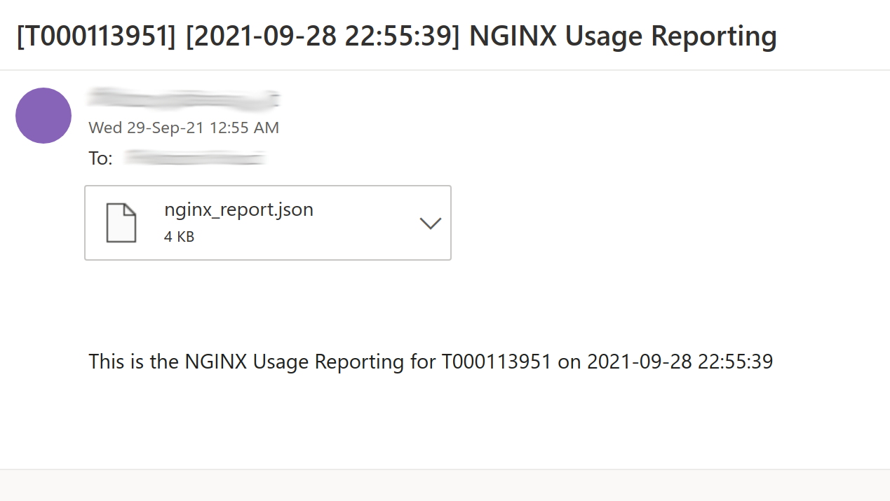

# Usage

## REST API mode

For `/instances` and `/f5tt/instances` endpoints if the request includes the `Accept-Encoding: gzip` header the response will be compressed

To get instance statistics in JSON format:

NGINX Instance Manager 1.x

```
$ curl -s http://f5tt.ff.lan/instances | jq
{
  "subscription": {
    "id": "NGX-Subscription-1-TRL-XXXXXX",
    "type": "INSTANCE_MANAGER",
    "version": "1.0.2",
    "serial": "6232847160738694"
  },
  "instances": [
    {
      "nginx_plus_online": 0,
      "nginx_oss_online": 1
    }
  ],
  "details": [
    {
      "instance_id": "c613e90d-3051-4090-b9cd-a32cb725b785",
      "uname": "Linux vm-gw 5.7.6 #1 SMP PREEMPT Fri Jun 26 17:39:22 CEST 2020 x86_64 QEMU Virtual CPU version 2.5+ AuthenticAMD GNU/Linux",
      "containerized": False,
      "type": "oss",
      "version": "1.20.1",
      "last_seen": "2021-08-31T11:37:04.587986759Z",
      "createtime": "2021-08-18T22:02:49.717530751Z",
      "modules": {},
      "networkconfig": {
        "host_ips": [
          "192.168.1.5",
          "192.168.1.27",
          "192.168.10.5",
          "192.168.11.5",
          "192.168.2.5",
          "10.200.200.10"
        ]
      },
      "hostname": "vm-gw",
      "CVE": [
        {}
      ]
    }
  ]
}
```

NGINX Instance Manager 2.x

```
$ curl -s http://f5tt.ff.lan/instances | jq 
{
  "subscription": {
    "id": "NGX-Subscription-1-TRL-XXXXXX",
    "type": "INSTANCE_MANAGER",
    "version": "",
    "serial": ""
  },
  "instances": {
    "nginx_plus_online": 1,
    "nginx_oss_online": 1
  },
  "details": [
    {
      "instance_id": "5b110d0d-a2e7-5d93-ae2b-2b908b169d46",
      "osInfo": {
        "name": "ubuntu",
        "version": "5.4.0-90-generic",
        "versionId": "20.04"
      },
      "hypervisor": "kvm",
      "type": "oss",
      "version": "1.18.0",
      "last_seen": "2021-12-21T23:42:45.961293545Z",
      "createtime": "2021-12-09T21:47:19Z",
      "modules": [
        "ngx_http_image_filter_module",
        "ngx_http_xslt_filter_module",
        "ngx_mail_module",
        "ngx_stream_module"
      ],
      "networkconfig": {
        "networkInterfaces": [
          {
            "ipv4AddressList": [
              {
                "address": "127.0.0.1",
                "netmask": "255.0.0.0",
                "prefixLen": 8
              }
            ],
            "ipv6AddressList": [
              {
                "address": "::1",
                "netmask": "ffff:ffff:ffff:ffff:ffff:ffff:ffff:ffff",
                "prefixLen": 128
              }
            ],
            "macAddress": "de:ad:be:ef:ff:25",
            "name": "ens3"
          },
          {
            "ipv4AddressList": [
              {
                "address": "192.168.1.25",
                "netmask": "255.255.255.0",
                "prefixLen": 24
              }
            ],
            "ipv6AddressList": [
              {
                "address": "fe80::dcad:beff:feef:ff25",
                "netmask": "ffff:ffff:ffff:ffff::",
                "prefixLen": 64
              }
            ],
            "macAddress": "de:ad:be:ef:ff:25",
            "name": "ens3"
          }
        ]
      },
      "hostname": "devel",
      "name": "devel",
      "CVE": [
        {}
      ]
    },
    {
      "instance_id": "98ebcece-3697-5d52-9806-51b15d7dfd78",
      "osInfo": {
        "name": "ubuntu",
        "version": "5.4.0-90-generic",
        "versionId": "20.04"
      },
      "hypervisor": "container",
      "type": "plus",
      "version": "1.21.3",
      "last_seen": "2022-01-06T22:40:03.243179608Z",
      "createtime": "2022-01-03T13:17:44Z",
      "modules": [
        "ngx_http_app_protect_module-debug",
        "ngx_http_app_protect_module",
        "ngx_http_js_module-debug",
        "ngx_http_js_module",
        "ngx_stream_js_module-debug",
        "ngx_stream_js_module"
      ],
      "networkconfig": {
        "networkInterfaces": [
          {
            "ipv4AddressList": [
              {
                "address": "127.0.0.1",
                "netmask": "255.0.0.0",
                "prefixLen": 8
              }
            ],
            "ipv6AddressList": [
              {
                "address": "::1",
                "netmask": "ffff:ffff:ffff:ffff:ffff:ffff:ffff:ffff",
                "prefixLen": 128
              }
            ],
            "macAddress": "de:ad:be:ef:ff:25",
            "name": "ens3"
          },
          {
            "ipv4AddressList": [
              {
                "address": "192.168.1.25",
                "netmask": "255.255.255.0",
                "prefixLen": 24
              }
            ],
            "ipv6AddressList": [
              {
                "address": "fe80::dcad:beff:feef:ff25",
                "netmask": "ffff:ffff:ffff:ffff::",
                "prefixLen": 64
              }
            ],
            "macAddress": "de:ad:be:ef:ff:25",
            "name": "ens3"
          }
        ]
      },
      "hostname": "devel",
      "name": "devel",
      "CVE": [
        {}
      ]
    }
  ]
}
```

NGINX Controller

```
$ curl -s http://f5tt.ff.lan/instances | jq 
{
  "subscription": {
    "id": "XYZ",
    "type": "NGINX Controller",
    "version": "3.18.2"
  },
  "instances": [
    {
      "location": "devops",
      "nginx_plus_online": 2,
      "nginx_plus_offline": 3
    },
    {
      "location": "production",
      "nginx_plus_online": 0,
      "nginx_plus_offline": 0
    },
    {
      "location": "unspecified",
      "nginx_plus_online": 0,
      "nginx_plus_offline": 2
    }
  ],
  "details": [
    {
      "instance_id": "2933d801-02f6-4a1e-bd76-213e6a723235",
      "uname": "linux Ubuntu 18.04.5 LTS (Bionic Beaver) x86_64 QEMU Virtual CPU version 2.5+",
      "containerized": True,
      "type": "plus",
      "version": "1.19.10",
      "last_seen": "2021-08-22T08:32:52.058499Z",
      "createtime": "2021-08-20T15:22:52.069915Z",
      "networkConfig": {
        "networkInterfaces": [
          {
            "name": "lo",
            "privateIP": "127.0.0.1"
          },
          {
            "name": "eth0",
            "privateIP": "10.244.2.31"
          }
        ]
      },
      "hostname": "nginx-76cd77586b-76g8k",
      "name": "nginx-devportal",
      "CVE": [
        {}
      ]
    },
    {
      "instance_id": "61b945d0-6e4d-4225-a91f-52ae36b290cc",
      "uname": "linux Ubuntu 18.04.5 LTS (Bionic Beaver) x86_64 QEMU Virtual CPU version 2.5+",
      "containerized": True,
      "type": "plus",
      "version": "1.19.10",
      "last_seen": "2021-09-15T16:37:48.566275Z",
      "createtime": "2021-08-23T10:11:48.527776Z",
      "networkConfig": {
        "networkInterfaces": [
          {
            "name": "lo",
            "privateIP": "127.0.0.1"
          },
          {
            "name": "eth0",
            "privateIP": "10.244.1.41"
          }
        ]
      },
      "hostname": "nginx-76cd77586b-xs5mm",
      "name": "nginx-76cd77586b-xs5mm",
      "CVE": [
        {}
      ]
    },
    {
      "instance_id": "e56260de-691f-4585-a4f5-9f6a93095f73",
      "uname": "linux Ubuntu 18.04.5 LTS (Bionic Beaver) x86_64 QEMU Virtual CPU version 2.5+",
      "containerized": True,
      "type": "plus",
      "version": "1.19.10",
      "last_seen": "2021-08-22T08:33:31.006875Z",
      "createtime": "2021-08-20T15:22:30.439847Z",
      "networkConfig": {
        "networkInterfaces": [
          {
            "name": "lo",
            "privateIP": "127.0.0.1"
          },
          {
            "name": "eth0",
            "privateIP": "10.244.2.30"
          }
        ]
      },
      "hostname": "nginx-76cd77586b-srb4c",
      "name": "nginx-76cd77586b-srb4c",
      "CVE": [
        {}
      ]
    },
    {
      "instance_id": "fb67428e-40f6-43a8-bcda-0621ee0d4331",
      "uname": "linux Ubuntu 18.04.5 LTS (Bionic Beaver) x86_64 QEMU Virtual CPU version 2.5+",
      "containerized": True,
      "type": "plus",
      "version": "1.19.10",
      "last_seen": "2021-09-15T16:37:46.244602Z",
      "createtime": "2021-08-23T10:11:46.561424Z",
      "networkConfig": {
        "networkInterfaces": [
          {
            "name": "lo",
            "privateIP": "127.0.0.1"
          },
          {
            "name": "eth0",
            "privateIP": "10.244.2.41"
          }
        ]
      },
      "hostname": "nginx-76cd77586b-n8f2k",
      "name": "nginx-api",
      "CVE": [
        {}
      ]
    },
    {
      "instance_id": "d78c7b6c-bde3-458c-933d-847d023bb2d5",
      "uname": "linux Ubuntu 20.04.3 LTS (Focal Fossa) x86_64 QEMU Virtual CPU version 2.5+",
      "containerized": False,
      "type": "plus",
      "version": "1.19.10",
      "last_seen": "2021-09-13T22:01:05.598863Z",
      "createtime": "2021-08-23T10:48:05.403247Z",
      "networkConfig": {
        "networkInterfaces": [
          {
            "name": "lo",
            "privateIP": "127.0.0.1",
            "privateIPv6": "::1"
          },
          {
            "name": "ens3",
            "privateIP": "192.168.1.26",
            "privateIPv6": "fe80::dcad:beff:feef:4413"
          },
          {
            "name": "docker0",
            "privateIP": "172.17.0.1",
            "privateIPv6": "fe80::42:1aff:fe50:e757"
          }
        ]
      },
      "hostname": "ubuntu",
      "name": "ubuntu",
      "CVE": [
        {}
      ]
    },
    {
      "instance_id": "ada757cf-df90-4125-b966-8db891431835",
      "uname": "linux Ubuntu 18.04.5 LTS (Bionic Beaver) x86_64 QEMU Virtual CPU version 2.5+",
      "containerized": True,
      "type": "plus",
      "version": "1.19.10",
      "last_seen": "2021-08-19T09:57:52.472761Z",
      "createtime": "2021-08-19T09:57:52.003188Z",
      "networkConfig": {
        "networkInterfaces": [
          {
            "name": "lo",
            "privateIP": "127.0.0.1"
          },
          {
            "name": "eth0",
            "privateIP": "10.244.1.29"
          }
        ]
      },
      "hostname": "nginx-646545df5d-h2p7f",
      "name": "nginx-646545df5d-h2p7f",
      "CVE": [
        {}
      ]
    },
    {
      "instance_id": "c9409b38-17d8-4345-9f31-b37f816195a8",
      "uname": "linux Ubuntu 18.04.5 LTS (Bionic Beaver) x86_64 QEMU Virtual CPU version 2.5+",
      "containerized": True,
      "type": "plus",
      "version": "1.19.10",
      "last_seen": "2021-08-19T09:57:53.956519Z",
      "createtime": "2021-08-19T09:57:53.478961Z",
      "networkConfig": {
        "networkInterfaces": [
          {
            "name": "lo",
            "privateIP": "127.0.0.1"
          },
          {
            "name": "eth0",
            "privateIP": "10.244.1.30"
          }
        ]
      },
      "hostname": "nginx-646545df5d-5wkqv",
      "name": "nginx-646545df5d-5wkqv",
      "CVE": [
        {}
      ]
    }
  ]
}
```

BIG-IQ

the `type` query string parameter can be used to retrieve a logical view of the full JSON file:

- Retrieve the standard full JSON: `curl -s http://f5tt.ff.lan/instances | jq`
- Retrieve a CVE-centric JSON: `curl -s http://f5tt.ff.lan/instances?type=CVE | jq`

```
$ curl -s http://f5tt.ff.lan/instances | jq
{
  "instances": [
    {
      "bigip": 2,
      "hwTotals": [
        {
          "F5-VE": 2
        }
      ],
      "swTotals": [
        {
          "H-VE-LTM": 2,
          "H-VE-DNS": 1,
          "H-VE-AWF": 1,
          "H-VE-AFM": 1
        }
      ]
    }
  ],
  "details": [
    {
      "hostname": "bigip1.f5.ff.lan",
      "address": "192.168.1.69",
      "product": "BIG-IP",
      "version": "16.1.0",
      "edition": "Final",
      "build": "0.0.19",
      "isVirtual": True,
      "isClustered": False,
      "platformMarketingName": "BIG-IP Virtual Edition",
      "restFrameworkVersion": "16.1.0-0.0.19",
      "inventoryTimestamp": "1636713114979",
      "inventoryStatus": "full",
      "platform": {
        "code": "Z100",
        "type": "VE",
        "sku": "F5-VE"
      },
      "registrationKey": "XXXXX-XXXXX-XXXXX-XXXXX-XXXXXXX",
      "chassisSerialNumber": "00000000-0000-0000-000000000000",
      "licenseEndDateTime": "2021-11-27T00:00:00+01:00",
      "licensedModules": [
        "adc",
        "BigIPDevice"
      ],
      "provisionedModules": [
        {
          "module": "afm",
          "level": "none",
          "sku": "H-VE-AFM"
        },
        {
          "module": "dos",
          "level": "",
          "sku": ""
        },
        {
          "module": "ltm",
          "level": "nominal",
          "sku": "H-VE-LTM"
        },
        {
          "module": "asm",
          "level": "none",
          "sku": "H-VE-AWF"
        },
        {
          "module": "avr",
          "level": "",
          "sku": ""
        },
        {
          "module": "sslo",
          "level": "none",
          "sku": "H-VE-SSLO"
        },
        {
          "module": "ilx",
          "level": "",
          "sku": ""
        },
        {
          "module": "cgnat",
          "level": "none",
          "sku": "H-VE-CGNAT"
        },
        {
          "module": "swg",
          "level": "",
          "sku": ""
        },
        {
          "module": "gtm",
          "level": "nominal",
          "sku": "H-VE-DNS"
        },
        {
          "module": "lc",
          "level": "",
          "sku": ""
        },
        {
          "module": "pem",
          "level": "none",
          "sku": "H-VE-PEM"
        },
        {
          "module": "apm",
          "level": "none",
          "sku": "H-VE-APM"
        },
        {
          "module": "urldb",
          "level": "",
          "sku": ""
        },
        {
          "module": "fps",
          "level": "",
          "sku": ""
        }
      ],
      "CVE": [
        {
          "CVE-2021-23037": {
            "id": "CVE-2021-23037",
            "url": "https://support.f5.com/csp/article/K21435974",
            "description": "On all versions of 16.1.x, 16.0.x, 15.1.x, 14.1.x, 13.1.x, 12.1.x, and 11.6.x, a reflected cross-site scripting (XSS) vulnerability exists in an undisclosed page of the BIG-IP Configuration utility that allows an attacker to execute JavaScript in the context of the currently logged-in user. Note: Software versions which have reached End of Technical Support (EoTS) are not evaluated.",
            "baseSeverity": "CRITICAL",
            "baseScore": 9.6,
            "exploitabilityScore": 8.6
          },
          "CVE-2021-23043": {
            "id": "CVE-2021-23043",
            "url": "https://support.f5.com/csp/article/K63163637",
            "description": "On BIG-IP, on all versions of 16.1.x, 16.0.x, 15.1.x, 14.1.x, 13.1.x, 12.1.x, and 11.6.x, a directory traversal vulnerability exists in an undisclosed page of the BIG-IP Configuration utility that allows an attacker to access arbitrary files. Note: Software versions which have reached End of Technical Support (EoTS) are not evaluated.",
            "baseSeverity": "MEDIUM",
            "baseScore": 6.5,
            "exploitabilityScore": 8
          }
        }
      ]
    },
    {
      "hostname": "bigip2.f5.ff.lan",
      "address": "192.168.1.70",
      "product": "BIG-IP",
      "version": "16.1.0",
      "edition": "Final",
      "build": "0.0.19",
      "isVirtual": True,
      "isClustered": False,
      "platformMarketingName": "BIG-IP Virtual Edition",
      "restFrameworkVersion": "16.1.0-0.0.19",
      "inventoryTimestamp": "1636713114979",
      "inventoryStatus": "full",
      "platform": {
        "code": "Z100",
        "type": "VE",
        "sku": "F5-VE"
      },
      "registrationKey": "XXXXX-XXXXX-XXXXX-XXXXX-XXXXXXX",
      "chassisSerialNumber": "00000000-0000-0000-000000000000",
      "licenseEndDateTime": "2021-11-26T00:00:00+01:00",
      "licensedModules": [
        "asmsecurity",
        "adc",
        "Access",
        "dns",
        "BigIPDevice",
        "networksecurity",
        "sharedsecurity"
      ],
      "provisionedModules": [
        {
          "module": "sslo",
          "level": "none",
          "sku": "H-VE-SSLO"
        },
        {
          "module": "gtm",
          "level": "none",
          "sku": "H-VE-DNS"
        },
        {
          "module": "cgnat",
          "level": "none",
          "sku": "H-VE-CGNAT"
        },
        {
          "module": "apm",
          "level": "none",
          "sku": "H-VE-APM"
        },
        {
          "module": "ltm",
          "level": "nominal",
          "sku": "H-VE-LTM"
        },
        {
          "module": "fps",
          "level": "",
          "sku": ""
        },
        {
          "module": "avr",
          "level": "",
          "sku": ""
        },
        {
          "module": "dos",
          "level": "",
          "sku": ""
        },
        {
          "module": "lc",
          "level": "",
          "sku": ""
        },
        {
          "module": "pem",
          "level": "none",
          "sku": "H-VE-PEM"
        },
        {
          "module": "urldb",
          "level": "",
          "sku": ""
        },
        {
          "module": "swg",
          "level": "",
          "sku": ""
        },
        {
          "module": "asm",
          "level": "nominal",
          "sku": "H-VE-AWF"
        },
        {
          "module": "ilx",
          "level": "",
          "sku": ""
        },
        {
          "module": "afm",
          "level": "nominal",
          "sku": "H-VE-AFM"
        }
      ],
      "CVE": [
        {
          "CVE-2021-23037": {
            "id": "CVE-2021-23037",
            "url": "https://support.f5.com/csp/article/K21435974",
            "description": "On all versions of 16.1.x, 16.0.x, 15.1.x, 14.1.x, 13.1.x, 12.1.x, and 11.6.x, a reflected cross-site scripting (XSS) vulnerability exists in an undisclosed page of the BIG-IP Configuration utility that allows an attacker to execute JavaScript in the context of the currently logged-in user. Note: Software versions which have reached End of Technical Support (EoTS) are not evaluated.",
            "tags": [
              "Mitigation",
              "Vendor Advisory"
            ]
          },
          "CVE-2021-23043": {
            "id": "CVE-2021-23043",
            "url": "https://support.f5.com/csp/article/K63163637",
            "description": "On BIG-IP, on all versions of 16.1.x, 16.0.x, 15.1.x, 14.1.x, 13.1.x, 12.1.x, and 11.6.x, a directory traversal vulnerability exists in an undisclosed page of the BIG-IP Configuration utility that allows an attacker to access arbitrary files. Note: Software versions which have reached End of Technical Support (EoTS) are not evaluated.",
            "tags": [
              "Vendor Advisory"
            ]
          }
        }
      ]
    }
  ],
  "telemetry": [
    {
      "bigip1.f5.ff.lan": {
        "cpu-usage": {
          "-1H": {
            "aggregate": 5.6210192305142765,
            "datapoints": [
              {
                "ts": 1641897300,
                "value": 5.740425419807434
              },
              {
                "ts": 1641897600,
                "value": 5.316933965682983
              }
            ]
          }
          "-1W": {
            [...]
          }
          "-1M": {
            [...]
          }
        },
        "free-ram": {
          [...]
        },
        "server-connections": {
          [...]
        },
        "client-bytes-in": {
          [...]
        },
        "client-bytes-out": {
          [...]
        },
        "server-bytes-in": {
          [...]
        },
        "server-bytes-out": {
          [...]
        }
      },
      "bigip2.f5.ff.lan": {
        [...]
      }
    }
  ],
  "utilityBilling": [
    {
      "product": "big-iq",
      "version": "8.1.0.2.0.0.36",
      "reportType": "pool usage",
      "poolType": "CLPv2",
      "regkey": "XXXXX-XXXXXX-XXX-XXXXXXX-XXXXXXX",
      "poolRegkey": "XXXXX-XXXXXX-XXX-XXXXXXX-XXXXXXX",
      "poolName": "Lab License Pool",
      "periodStarted": "2022-01-25T10:59:02Z",
      "periodEnded": "2022-01-25T11:08:10Z",
      "records": []
    },
    [...]
  ]
}
```

Prometheus endpoint:

Pulling from NGINX Instance Manager

```
$ curl -s http://f5tt.ff.lan/metrics
# HELP nginx_oss_online_instances Online NGINX OSS instances
# TYPE nginx_oss_online_instances gauge
nginx_oss_online_instances{subscription="NGX-Subscription-1-TRL-064788",instanceType="INSTANCE_MANAGER",instanceVersion="1.0.2",instanceSerial="6232847160738694"} 1
# HELP nginx_plus_online_instances Online NGINX Plus instances
# TYPE nginx_plus_online_instances gauge
nginx_plus_online_instances{subscription="NGX-Subscription-1-TRL-064788",instanceType="INSTANCE_MANAGER",instanceVersion="1.0.2",instanceSerial="6232847160738694"} 0
```

Pulling from NGINX Controller

```
$ curl -s http://f5tt.ff.lan/metrics
# HELP nginx_plus_online_instances Online NGINX Plus instances
# TYPE nginx_plus_online_instances gauge
nginx_plus_online_instances{subscription="NGX-Subscription-1-TRL-046027",instanceType="NGINX Controller",instanceVersion="3.18.2",location="test"} 0
# HELP nginx_plus_offline_instances Offline NGINX Plus instances
# TYPE nginx_plus_offline_instances gauge
nginx_plus_offline_instances{subscription="NGX-Subscription-1-TRL-046027",instanceType="NGINX Controller",instanceVersion="3.18.2",location="test"} 0
# HELP nginx_plus_online_instances Online NGINX Plus instances
# TYPE nginx_plus_online_instances gauge
nginx_plus_online_instances{subscription="NGX-Subscription-1-TRL-046027",instanceType="NGINX Controller",instanceVersion="3.18.2",location="unspecified"} 2
# HELP nginx_plus_offline_instances Offline NGINX Plus instances
# TYPE nginx_plus_offline_instances gauge
nginx_plus_offline_instances{subscription="NGX-Subscription-1-TRL-046027",instanceType="NGINX Controller",instanceVersion="3.18.2",location="unspecified"} 283
```

Pulling from BIG-IQ

```
$ curl -s https://f5tt.ff.lan/metrics
# HELP bigip_online_instances Online BIG-IP instances
# TYPE bigip_online_instances gauge
bigip_online_instances{dataplane_type="BIG-IQ",dataplane_url="https://bigiq.f5.ff.lan"} 2
# HELP bigip_hwTotals Total hardware devices count
# TYPE bigip_hwtotals gauge
bigip_hwtotals{dataplane_type="BIG-IQ",dataplane_url="https://bigiq.f5.ff.lan",bigip_sku="F5-VE"} 1
# HELP bigip_swTotals Total software modules count
# TYPE bigip_swtotals gauge
bigip_swtotals{dataplane_type="BIG-IQ",dataplane_url="https://bigiq.f5.ff.lan",bigip_module="H-VE-APM"} 1
bigip_swtotals{dataplane_type="BIG-IQ",dataplane_url="https://bigiq.f5.ff.lan",bigip_module="H-VE-DNS"} 1
bigip_swtotals{dataplane_type="BIG-IQ",dataplane_url="https://bigiq.f5.ff.lan",bigip_module="H-VE-LTM"} 1
bigip_swtotals{dataplane_type="BIG-IQ",dataplane_url="https://bigiq.f5.ff.lan",bigip_module="H-VE-CGNAT"} 1
# HELP bigip_tmos_releases TMOS releases count
# TYPE bigip_tmos_releases gauge
bigip_tmos_releases{dataplane_type="BIG-IQ",dataplane_url="https://bigiq.f5.ff.lan",tmos_release="16.1.0"} 2
# HELP bigip_tmos_cve TMOS CVE count
# TYPE bigip_tmos_cve gauge
bigip_tmos_cve{dataplane_type="BIG-IQ",dataplane_url="https://bigiq.f5.ff.lan",tmos_cve="CVE-2022-23019"} 1
bigip_tmos_cve{dataplane_type="BIG-IQ",dataplane_url="https://bigiq.f5.ff.lan",tmos_cve="CVE-2022-23021"} 1
bigip_tmos_cve{dataplane_type="BIG-IQ",dataplane_url="https://bigiq.f5.ff.lan",tmos_cve="CVE-2022-23032"} 1
bigip_tmos_cve{dataplane_type="BIG-IQ",dataplane_url="https://bigiq.f5.ff.lan",tmos_cve="CVE-2022-23022"} 1
bigip_tmos_cve{dataplane_type="BIG-IQ",dataplane_url="https://bigiq.f5.ff.lan",tmos_cve="CVE-2022-23020"} 1
bigip_tmos_cve{dataplane_type="BIG-IQ",dataplane_url="https://bigiq.f5.ff.lan",tmos_cve="CVE-2022-23016"} 1
bigip_tmos_cve{dataplane_type="BIG-IQ",dataplane_url="https://bigiq.f5.ff.lan",tmos_cve="CVE-2022-23014"} 1
bigip_tmos_cve{dataplane_type="BIG-IQ",dataplane_url="https://bigiq.f5.ff.lan",tmos_cve="CVE-2022-23030"} 1
bigip_tmos_cve{dataplane_type="BIG-IQ",dataplane_url="https://bigiq.f5.ff.lan",tmos_cve="CVE-2022-23025"} 1
bigip_tmos_cve{dataplane_type="BIG-IQ",dataplane_url="https://bigiq.f5.ff.lan",tmos_cve="CVE-2022-23023"} 1
bigip_tmos_cve{dataplane_type="BIG-IQ",dataplane_url="https://bigiq.f5.ff.lan",tmos_cve="CVE-2021-23037"} 1
bigip_tmos_cve{dataplane_type="BIG-IQ",dataplane_url="https://bigiq.f5.ff.lan",tmos_cve="CVE-2021-23043"} 1
```

## Push mode to custom URL

Sample unauthenticated POST payload:

```
POST /callHome HTTP/1.1
Host: 192.168.1.18
User-Agent: python-requests/2.22.0
Accept-Encoding: gzip, deflate
Accept: */*
Connection: keep-alive
Content-Type: application/json
Content-Length: 267

{
  "subscription": {
    "id": "NGX-Subscription-1-TRL-XXXXXX",
    "type": "INSTANCE_MANAGER",
    "version": "1.0.2",
    "serial": "6232847160738694"
  },
  ...
}
```

Sample POST payload with Basic Authentication

```
POST /callHome HTTP/1.1
Host: 192.168.1.18
User-Agent: python-requests/2.22.0
Accept-Encoding: gzip, deflate
Accept: */*
Connection: keep-alive
Content-Type: application/json
Content-Length: 267
Authorization: Basic YWE6YmI=

{
  "subscription": {
    "id": "NGX-Subscription-1-TRL-XXXXXX",
    "type": "INSTANCE_MANAGER",
    "version": "1.0.2",
    "serial": "6232847160738694"
  },
  ...
}
```


## High level reporting

A dynamically updated report in xls format can be downloaded by accessing either:

- `/reporting/xls`
- `/f5tt/reporting/xls`

This is currently available when querying BIG-IQ


# Visualization

See [Grafana](/contrib/grafana)


# Sample report e-mail


